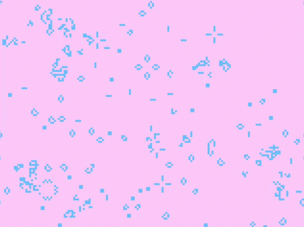

# Conway's Game of Life

Implementación del clásico algoritmo celular inventado por el matemático John Horton Conway, renderizado en tiempo real desde cero en Rust utilizando un Framebuffer personalizado.

## Demostración




## Características del Proyecto

- **Lógica de Wrap-Around (Efecto Pac-Man):** Las células que cruzan el límite derecho o inferior de la pantalla reaparecen por el lado opuesto, permitiendo que las naves floten infinitamente sin chocar con un muro.
- **Resolución Personalizada:** Mundo interno de `160x120` células, escalado dinámicamente a una ventana de `800x600` sin pérdida de aspecto
- **Colores Personalizados:** Células vivas en `0x66BAFF` y muertas en `0xFFD1FB`.

## Organismos y Patrones Incluidos

El simulador se carga inicialmente con más de 10 patrones clásicos y avanzados para máxima entropía:
1. **True Puffer Train:** (Gosper's Puffer 1) Una colosal estructura móvil que avanza dejando atrás humo y escombros.
2. **Glider Fleet:** Un escuadrón sincronizado de naves (Spaceships).
3. **Osciladores:** Pulsar, Penta-decathlon, Toad, Beacon y Blinker.
4. **Gosper Glider Gun:** Un arma que dispara Gliders infinitamente.
5. **Still Lifes:** Bloques estáticos.
6. **Sopa Primordial:** Un cuadrante entero inicializado aleatoriamente al principio de la simulación.

## Cómo Ejecutar

Para correr la simulación, asegúrate de tener Rust instalado y ejecuta:

```bash
cargo run
```
